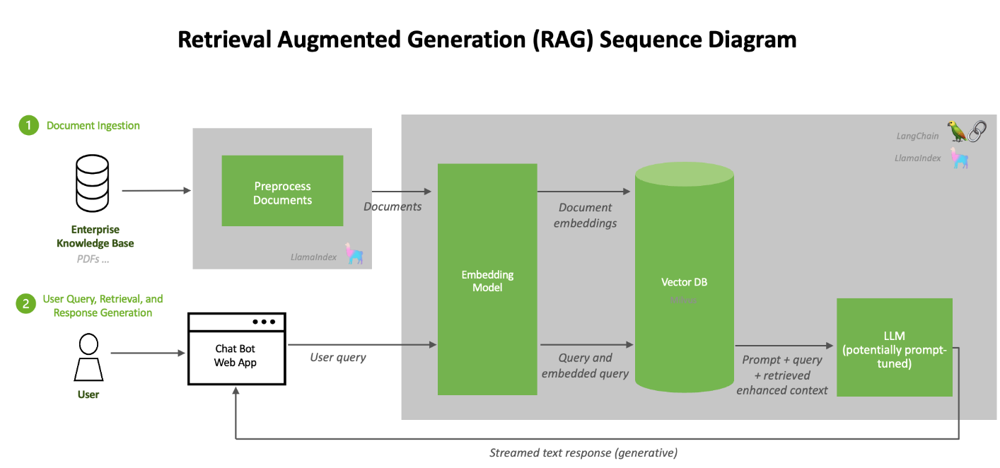
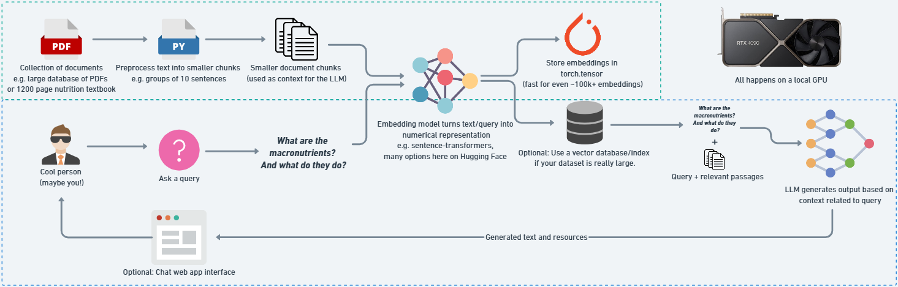

# RAG Overview:

# Create RAG pipeline from scratch

# __RAG:__
RAG stands for Retrieval Augmented Generation. The goal of RAG is to take information and pass it to an LLM so it can generate outputs based on that information.

**Retrieval** - Find relevant information given a query, e.g. "what are the macronutrients and what they do?" -> retrieves passages of text related to the macronutrients from a nutrition notebook.

**Augmented**: We want to take the relevant information and augment our input(prompts) to an LLM with that relevant information.

**Generation**: Take the first two steps and pass them to an LLM for generative outputs.

# __WHY RAG:__
The main goal of RAG is to improve the generation outputs of LLMs.
1. __Prevent Hallucinations__ - LLMs are good at generating good *looking* texxt, however, this text doesn'tmean that it's factual. RAG can help LLMs generate information based on relevant passages that are factual.
2. __Work with Custom Data__: Many base LLMs are trained on internet data. This means they have a fairly good understanding of language in general. However, it also does a lot of their responses can be generic in nature. RAG helps to create specific responses based on specific documents.

# __What can RAG be used for?__
* Customer Support Q&A Chat.
* Email Chain Analysis.
* Company Internal Documentation Chat.
* Textbook Q&A.

_Common theme is that to take your documents to a query and process them with an LLM_

# __WHY RUN LOCALLY:__
* Privacy.
* Speed.
* No Vendor Locking.
* My Own System.

# __OPEN SOURCE LLMs:__
- Gemma 
- Mistral AI
- Ollama
- Hugging Face

# __OPEN SOURCE EMBEDDING MODELS__:
- SentenceTransformers. `all-mpnet-base-v2`
- MTEB (Massive Text Embedding Benchmark).

_We are going to build ChatBot on the Nutrients Book. Steps:_
1. Open a PDF document.
2. Format the text of the PDF textbook for the embedding model.
3. Embeed all the chunks of text into numerical representations.
4. Build a Retrieval system that uses vector search to find relevant chunk of text based on a query.
5. Create a prompt that incorporates the retrieved pieces of text.
6. Generate an answer to a query based on the passages of the textbook withat an LLM.

# Project Methodology:

# Key Terms & Description:

| Term | Description |
|------|-------------|
| **Token** | A sub-word piece of text. For example, `"hello, world!"` could be split into `["hello", ",", "world", "!"]`. A token can be a whole word, part of a word or group of punctuation characters. ~1 token = 4 characters in English, 100 tokens ≈ 75 words. Text gets broken into tokens before being passed to an LLM. |
| **Embedding** | A learned numerical representation of a piece of data. For example, a sentence of text could be represented by a vector with 768 values. Similar pieces of text (in meaning) will ideally have similar values. |
| **Embedding model** | A model designed to accept input data and output a numerical representation. For example, a text embedding model may take in 384 tokens of text and turn it into a vector of size 768. An embedding model can (and often is) different from an LLM model. |
| **Similarity search / Vector search** | Aims to find two vectors which are close together in high-dimensional space. For example, two pieces of similar text passed through an embedding model should have a high similarity score, whereas two pieces of text about different topics will have a lower similarity score. Common similarity score measures are **dot product** and **cosine similarity**. |
| **Large Language Model (LLM)** | A model which has been trained to numerically represent the patterns in text. A generative LLM will continue a sequence when given a sequence. For example, given `"hello, world!"`, a generative LLM may produce `"we're going to build a RAG pipeline today!"`. This generation is highly dependent on the training data and prompt. |
| **LLM context window** | The number of tokens an LLM can accept as input. For example, as of March 2024, GPT-4 has a default context window of **32k tokens** (~96 pages of text) but can go up to **128k**. A recent open-source LLM from Google, **Gemma (March 2024)**, has a context window of **8,192 tokens** (~24 pages of text). A higher context window means an LLM can accept more relevant information to assist with a query. In a RAG pipeline, this allows more reference items from the retrieval system to aid with generation. |
| **Prompt** | The input to a generative LLM. "Prompt engineering" refers to structuring this input in a specific way so that the generated output is ideal. This works because of an LLM’s in-context learning ability: it can use its language representation to interpret the prompt and generate a suitable output. Since LLM outputs are probabilistic, wording like "may output" is used. |